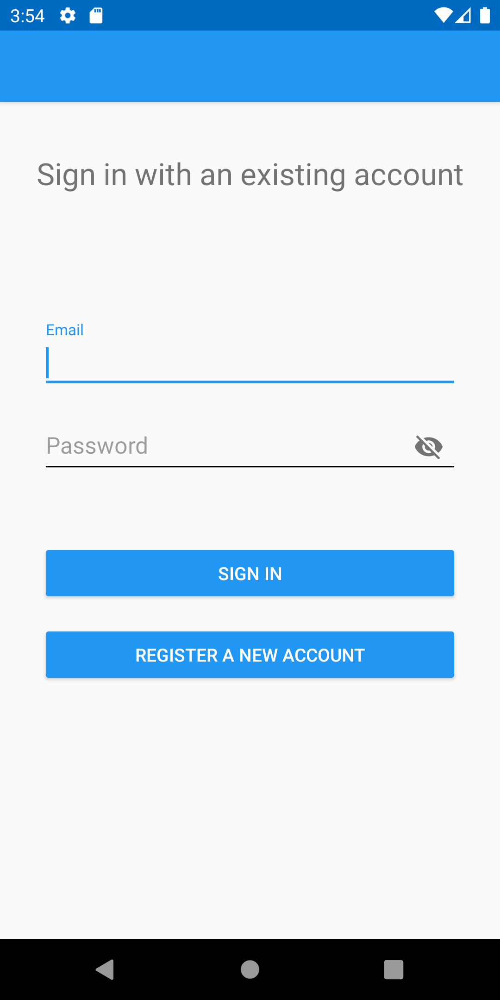
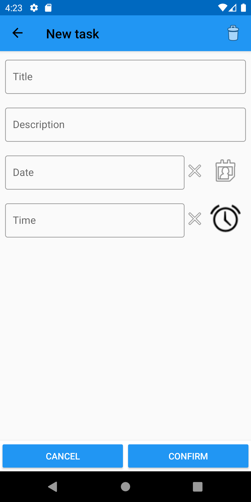

# MyTodoList

Android application wrote in Kotlin.

This is a personal project I'm developing to train my skills.

## Description

A simple todo list where you can create a task and validate it when it's done.

Register a new account and login to access them.

## Build with

* [Kotlin](https://kotlinlang.org/) - Language
* [Firebase](https://firebase.google.com/) - Authentication
* [Cloud Firestore](https://firebase.google.com/docs/firestore) - Database
* [KOIN](https://insert-koin.io/) - Dependency injection

I'm trying to follow and apply the MVC pattern / clean architecture

## Screenshots

## Future features / Things I want to use

* tests
* alerts and notifications
* app parameters
* better design / animations
* night theme
* login with Google
* app bundle
* deep links
